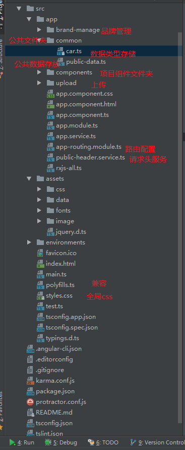

# angular4-primeng-admin

项目地址预览地址:http://1.myhbb.applinzi.com/dist1/login

项目目前基于

[Angular4](https://angular.cn/docs/ts/latest/quickstart.html) [Angular CLI]

[Angular CLI](https://cli.angular.io/) [Angular CLI]

[primeNg](https://www.primefaces.org/primeng/#/) version `4.0.2`.[primeNg]

[js-base64](https://github.com/dankogai/js-base64) version `2.1.5`.[js-base64]

[ngx-uploader](https://github.com/jkuri/ngx-uploader) version `3.0.5`.[ngx-uploader]目前没写

[项目预览](http://1.myhbb.applinzi.com/dist1/index.html) version `1.0.0`.

## 下载@angular/cli

npm 下载   npm install -g @angular/cli

如果下载cli失败,(公司网有可能被抢了),`请尝试管理员身份运行CMD` 尝试下载

npm install  (下载依赖的时候cnpm快,但是直接下载的可能有问题,另外交大家一个,首先用npm下载,若果碰到有个文件下不下来报错,切换成cnpm跑完,那么就可以了)

Run `ng serve` for a dev server. Navigate to `http://localhost:4200/`. The app will automatically reload if you change any of the source files.

## Build

Run `ng build` to build the project. The build artifacts will be stored in the `dist/` directory. Use the `-prod` flag for a production build.

如果你想得到更小的包 Run `ng build --prod --aot`

