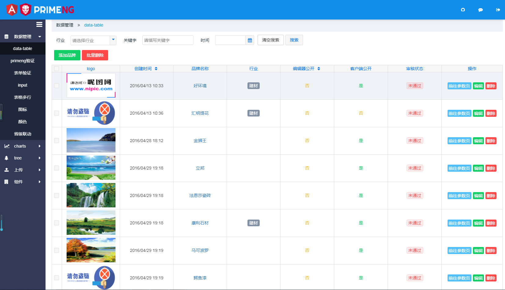
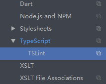

# angular4-primeng-admin

项目地址预览地址:http://1.myhbb.applinzi.com/dist1/login

自己克隆他的官网代码布置的国内文档,国外的有点慢:http://1.backapp.applinzi.com/dist/#/inputtext

项目介绍:项目后台模板,展示了一个真实的项目模板,从零到bulid的过程,以及primeng的坑 , 

1,项目暂时不去展示ng4的一些组件,主要展示 primeng 的用法以及 ng4的简单用法,针对刚学习ng4的同学 

2,项目 , 展示了真实的增删改查 ,分页 ,等,数据是json格式,但是该写的都写了只差一个正确的接口

3,项目 展示了 登录 以及工作区域 子路由的配置关系

4,项目 展示了 若何把http封装成 一个公共的  ajax 

5,项目展示了 primeng 的引用 以及 他的常用组件的用法

6,项目展示了 primeng 的 皮肤制作(都说要接近国情)

7,当你用ng4开发后台的时候,不知道该选用什么UI,那么不妨看看 [primeNg](https://www.primefaces.org/primeng/#/)

项目目前基于

[Angular5](https://angular.cn/docs/ts/latest/quickstart.html) [Angular CLI]

[Angular CLI](https://cli.angular.io/) [Angular CLI]

[primeNg](https://www.primefaces.org/primeng/#/) version ` 5.0.0-rc.0`.[primeNg]

[js-base64](https://github.com/dankogai/js-base64) version `2.1.5`.[js-base64]

[ngx-uploader](https://github.com/jkuri/ngx-uploader) version `4.2.1`.[ngx-uploader]
 
[ngx-toastr](https://github.com/scttcper/ngx-toastr) version `6.5.0`.[ngx-toastr]

[项目预览](http://1.myhbb.applinzi.com/dist1/index.html) version `1.1.0`.

## 下载@angular/cli

npm 下载   npm install -g @angular/cli

如果下载cli失败,(公司网有可能被抢了),`请尝试管理员身份运行CMD` 尝试下载

npm install  (下载依赖的时候cnpm快,但是直接下载的可能有问题,另外交大家一个,首先用npm下载,若果碰到有个文件下不下来报错,切换成cnpm跑完,那么就可以了)

Run `ng serve` for a dev server. Navigate to `http://localhost:4200/`. The app will automatically reload if you change any of the source files.

## 效果图

#### 对于webstorm的朋友如果下下来抱tslint错误,可以把tslint关闭了

## 更新记录
2017/09/20

1,更新cli版本以及primeng版本

2,制作一个自己的皮肤

2018/01/01

1,更新cli版本以及primeng版本至5.0

# 关于

大家若果感觉有帮助,可以帮忙点个star, O(∩_∩)O~~~ ,我会继续更新的

primeng 的群  163085042  欢迎大家来一起学习,我是个小白,我会积极回答大家的问题,一起学习ng以及primeng的 O(∩_∩)O~~

我的QQ  875670250
